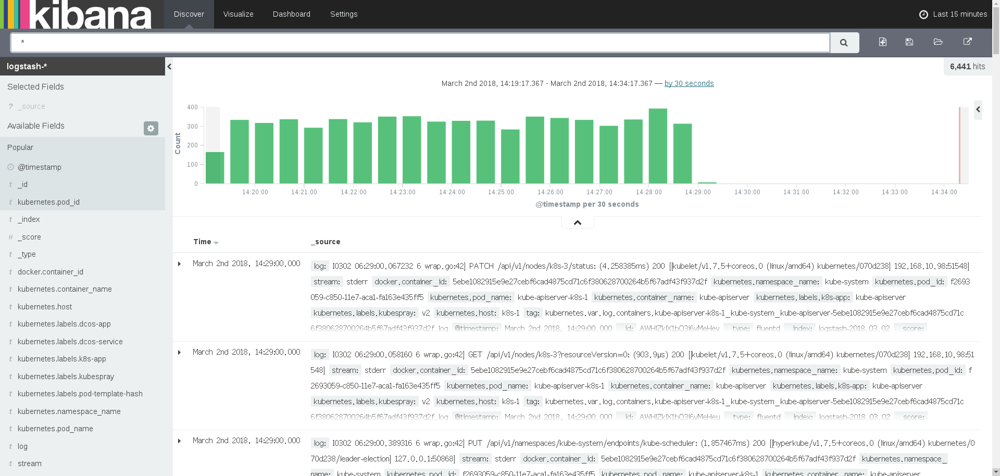

## 1.0 环境
**镜像版本**

| app | 镜像 |
|--------|--------|
|  fluentd     | gcr.io/google_containers/fluentd-elasticsearch：1.22    |
|  elasticsearch   | gcr.io/google_containers/elasticsearch：v2.4.1      |
|  kibana   |  gcr.io/google_containers/kibana:v4.6.1     |


**作用介绍**
- Logstash(或者Fluentd)负责收集日志
- Elasticsearch存储日志并提供搜索
- Kibana负责日志查询和展示

## 1.1 Elasticsearch在kubrentes集群上安装
可以参考**kubernetes**项目下[cluster/addons/fluentd-elasticsearc](http://https://github.com/kubernetes/kubernetes/tree/master/cluster/addons/fluentd-elasticsearch)

### 1.1.1 存在问题
Elasticsearch StatefulSet将使用EmptyDir卷来存储数据。EmptyDir在pod终止时被删除，此处仅用于测试目的。**重要提示**：请在实际使用您的设置中的StatefulSet之前将存储更改为持久性卷声明！

- - -

**解决方法**
- 此镜像需要有两个节点以上才可以有效启动，因为每个实例都需要独立pv，不能用`deployment`创建，只能通过`statefulset`创建。
- 在启动前需要根据stateful创建对应数据pv。
- 当前pv是采用flexvolme调用字义文件块存储插件创建

### 1.1.2 创建Elasticsearch需要pv
下面例子是，分别在`k8s-3`,`k8s-2`两台机器上分别创建10Gb文件块给Elasticsearch使用， [elasticsearch-pv.yaml](./yaml/elasticsearch-pv.yaml)
```
---
apiVersion: v1
kind: PersistentVolume
metadata:
  name: es-persistent-storage1
  labels:
     localstorage: es-pv
  annotations:
    volume.alpha.kubernetes.io/node-affinity: >
      {
         "requiredDuringSchedulingIgnoredDuringExecution": {
           "nodeSelectorTerms": [
            { "matchExpressions": [
               { "key": "kubernetes.io/hostname",
                 "operator": "In",
                 "values": ["k8s-3"] #配置pv所在机器
               }
           ]}
         ]}
      }
spec:
  capacity:
    storage: 10000Mi
  accessModes:
  - ReadWriteOnce
  storageClassName: local-storage
  flexVolume:
    driver: "flex/fileblkdev"
    fsType: "xfs"
    options:
      blkfile: "/pv-data/es-persistent-storage1.img" #配置文件块所在host机器路径
      size: "10000M"

---
apiVersion: v1
kind: PersistentVolume
metadata:
  name: es-persistent-storage2
  labels:
     localstorage: es-pv
  annotations:
    volume.alpha.kubernetes.io/node-affinity: >
      {
         "requiredDuringSchedulingIgnoredDuringExecution": {
           "nodeSelectorTerms": [
            { "matchExpressions": [
               { "key": "kubernetes.io/hostname",
                 "operator": "In",
                 "values": ["k8s-2"] #配置pv所在机器
               }
           ]}
         ]}
      }
spec:
  capacity:
    storage: 10000Mi
  accessModes:
  - ReadWriteOnce
  storageClassName: local-storage
  flexVolume:
    driver: "flex/fileblkdev"
    fsType: "xfs"
    options:
      blkfile: "/pv-data/es-persistent-storage2.img" #配置文件块所在host机器路径
      size: "10000M"
```

然后提交pv到kubernetes上，命令如下:
```
$ kubectl create -f elasticsearch-pv.yaml
```

* * *


### 1.1.3 通过Statefulset创建Elasticsearch实例
在kubernets `kube-system`命名空间下部署Elasticsearch， 编辑[elasticsearch-statefulset.yaml](./yaml/elasticsearch-statefulset.yaml)

**提示**
需要根据实际情况修改image镜像地址， 例如
`images 192.168.0.1/gcr.io/google_containers/elasticsearch:v2.4.1`

```
---
# https://raw.githubusercontent.com/kubernetes/kubernetes/v1.5.2/cluster/addons/fluentd-elasticsearch/es-controller.yaml
apiVersion: apps/v1beta1
kind: StatefulSet
metadata:
  name: elasticsearch-logging-v1
  namespace: "kube-system"
  labels:
    k8s-app: elasticsearch-logging
    version: "v2.4.1"
    kubernetes.io/cluster-service: "true"
spec:
  serviceName: elasticsearch-logging
  replicas: 2
  selector:
    matchLabels:
      k8s-app: elasticsearch-logging
      version: "v2.4.1"
  template:
    metadata:
      labels:
        k8s-app: elasticsearch-logging
        version: "v2.4.1"
        kubernetes.io/cluster-service: "true"
    spec:
      containers:
      - image: "192.168.0.1：5000/gcr.io/google_containers/elasticsearch:v2.4.1" #根据实际情况使用本地仓库镜像
        name: elasticsearch-logging
        resources:
          # need more cpu upon initialization, therefore burstable class
          limits:
            cpu: 1000m
            memory: 1024Mi
          requests:
            cpu: 100m
            memory: 100Mi
        ports:
        - containerPort: 9200
          name: db
          protocol: TCP
        - containerPort: 9300
          name: transport
          protocol: TCP
        volumeMounts:
        - name: es-persistent-storage
          mountPath: /data
  volumeClaimTemplates:
  - metadata:
      name: es-persistent-storage
    spec:
      accessModes:
      - ReadWriteOnce
      resources:
        requests:
          storage: 10000Mi
      storageClassName: local-storage #必须和pv一致
```
启用`elasticsearch`服务
```
$kubectl create -f elasticsearch-statefulset.yaml
```

**验证**
1) 获取事件
```
$kubectl describe statefulsets elasticsearch-logging --namespace=kube-system
```

2) 获取对应pod
```
$kubectl get statefulsets elasticsearch-logging-v1
NAME                       DESIRED   CURRENT   AGE
elasticsearch-logging-v1   2         2         4h
```

### 1.1.4 导出elasticsearch服务
配置 kibana-service.yaml
```
---
apiVersion: v1
kind: Service
metadata:
  name: elasticsearch-logging
  namespace: "kube-system"
  labels:
    k8s-app: elasticsearch-logging
    kubernetes.io/cluster-service: "true"
    kubernetes.io/name: "Elasticsearch"
spec:
  ports:
  - port: 9200
    protocol: TCP
    targetPort: db
  selector:
    k8s-app: elasticsearch-logging
```
**提示：**
- 由于elasticsearch内部服务，不提高对外端口，使用clusterip方式。

* * *

### 1.2 fluentd安装
fluentd是安装在所有机器上收集日志，收集日志条件可以编辑

### 1.2.1 配置收集日志条件
搜集条件可以编辑fluentd-config.yaml, 详细可以查看模版fluentd-config.yaml.j2
```
apiVersion: v1
kind: ConfigMap
metadata:
  name: fluentd-config
  namespace: kube-system
data:
  fluentd.conf: |
    <match fluent.**>
      type null
    </match>
    # Example:
    # {"log":"[info:2016-02-16T16:04:05.930-08:00] Some log text here\n","stream":"stdout","time":"2016-02-17T00:04:05.931087621Z"}
    <source>
      type tail
      path /var/log/containers/*.log
      pos_file /var/log/es-containers.log.pos
      time_format %Y-%m-%dT%H:%M:%S.%NZ
      tag kubernetes.*
      format json
      read_from_head true
    </source>
    <filter kubernetes.**>
      type kubernetes_metadata
    </filter>
    <match **>
       type elasticsearch
       user "#{ENV['FLUENT_ELASTICSEARCH_USER']}"
       password "#{ENV['FLUENT_ELASTICSEARCH_PASSWORD']}"
       log_level info
       include_tag_key true
       host elasticsearch-logging
       port 9200
       logstash_format true
       # Set the chunk limit the same as for fluentd-gcp.
       buffer_chunk_limit 2M
       # Cap buffer memory usage to 2MiB/chunk * 32 chunks = 64 MiB
       buffer_queue_limit 32
       flush_interval 5s
       # Never wait longer than 5 minutes between retries.
       max_retry_wait 30
       # Disable the limit on the number of retries (retry forever).
       disable_retry_limit
       # Use multiple threads for processing.
       num_threads 8
    </match>
```

这里是收集kubernetes下的所有pod日志。

提交fluentd配置
```
$kubectl apply -f fluentd-config.yaml
```

### 1.2.2 启动fluentd

**daemonset**
默认在所有kubernetes集群所有节点自动启动，例如用户新添加节点，机群就会在新的节点上启动

配置fluentd-ds.yaml
```
---
# https://raw.githubusercontent.com/kubernetes/kubernetes/v1.5.2/cluster/addons/fluentd-elasticsearch/es-controller.yaml
apiVersion: extensions/v1beta1
kind: DaemonSet
metadata:
  name: "fluentd-es-v1.22"
  namespace: "kube-system"
  labels:
    k8s-app: fluentd-es
    kubernetes.io/cluster-service: "true"
    version: "v1.22"
spec:
  template:
    metadata:
      labels:
        k8s-app: fluentd-es
        kubernetes.io/cluster-service: "true"
        version: "v1.22"
    spec:
      tolerations:
        - effect: NoSchedule
          operator: Exists
      containers:
      - name: fluentd-es
        image: "192.168.10.1:5000/gcr.io/google_containers/fluentd-elasticsearch:1.22"
        command:
          - '/bin/sh'
          - '-c'
          - '/usr/sbin/td-agent -c /etc/kubernetes/fluentd/fluentd.conf 2>&1 >> /var/log/fluentd.log'
        resources:
          limits:
            memory: 200Mi
          requests:
            cpu:  100m
            memory: 200Mi
        volumeMounts:
        - name: varlog
          mountPath: /var/log
        - name: varlibdockercontainers
          mountPath: /var/lib/docker/containers
          readOnly: true
        - name: config
          mountPath: "/etc/kubernetes/fluentd"
      terminationGracePeriodSeconds: 30
      volumes:
      - name: varlog
        hostPath:
          path: /var/log
      - name: varlibdockercontainers
        hostPath:
          path: /var/lib/docker/containers
      - name: config #映射配置文件
        configMap:
          name: fluentd-config
```

启动fluentd
```
$ kubectl create -f fluentd-ds.yaml
```

**验证:**
- 获取错误事件
```
$ kubectl describe daemonset fluentd-es-v1.22 --namespace=kube-system
```
- 获取pod数目
```
$kubectl get daemonset fluentd-es-v1.22 --namespace=kube-system
NAME               DESIRED   CURRENT   READY     UP-TO-DATE   AVAILABLE   NODE-SELECTOR   AGE
fluentd-es-v1.22   3         3         3         3            3           <none>          5h
```

### 1.3 kibana 安装

### 1.3.1 部署kibana
配置[kibana-deployment.yaml](./yaml/kibana-deployment.yaml)

```
---
# https://raw.githubusercontent.com/kubernetes/kubernetes/v1.5.2/cluster/addons/fluentd-kibana/kibana-controller.yaml
apiVersion: extensions/v1beta1
kind: Deployment
metadata:
  name: kibana-logging
  namespace: "kube-system"
  labels:
    k8s-app: kibana-logging
    kubernetes.io/cluster-service: "true"
spec:
  replicas: 1
  selector:
    matchLabels:
      k8s-app: kibana-logging
  template:
    metadata:
      labels:
        k8s-app: kibana-logging
    spec:
      containers:
      - name: kibana-logging
        image: "192.168.10.96:5000/gcr.io/google_containers/kibana:v4.6.1"
        resources:
          # keep request = limit to keep this container in guaranteed class
          limits:
            cpu: 100m
            memory: 1Gi
          requests:
            cpu: 100m
            memory: 100Mi
        env:
          - name: "ELASTICSEARCH_URL"
            value: "http://elasticsearch-logging:9200"
          - name: "KIBANA_BASE_URL"
            value: "/api/v1/proxy/namespaces/kube-system/services/kibana-logging"
        ports:
        - containerPort: 5601
          name: ui
          protocol: TCP
```
启动在集群启动kibana
```
$kubectl create -f kibana-deployment.yaml
```

### 1.3.2 配置kibana服务端口

配置文件[kibana-service.yaml](./yaml/kibana-service.yaml)
```
---
apiVersion: v1
kind: Service
metadata:
  name: kibana-logging
  namespace: "kube-system"
  labels:
    k8s-app: kibana-logging
    kubernetes.io/cluster-service: "true"
    kubernetes.io/name: "Kibana"
spec:
  ports:
  - port: 5601
    protocol: TCP
    targetPort: ui
  selector:
    k8s-app: kibana-logging
```

### 1.3.3 登陆kibana
kibana 启动需要一段时间，可以启动以后可以通过浏览器输入:
`k8s-master:8080/api/v1/proxy/namespaces/kube-system/services/kibana-logging` 截图如下:
