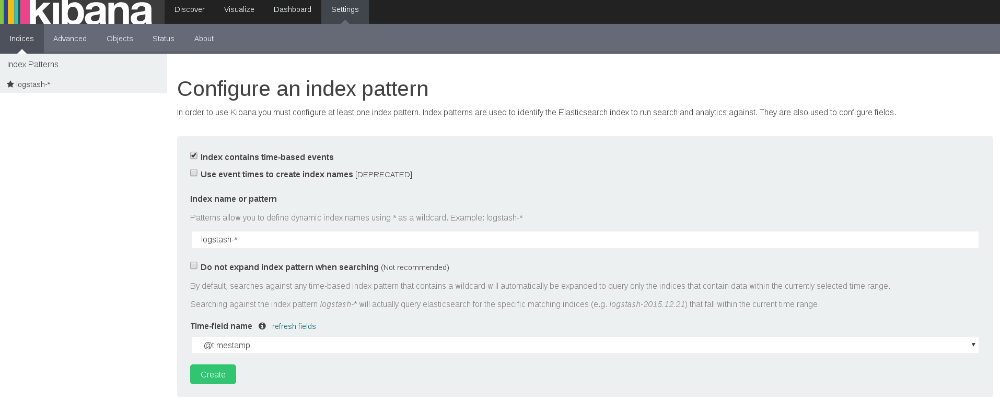
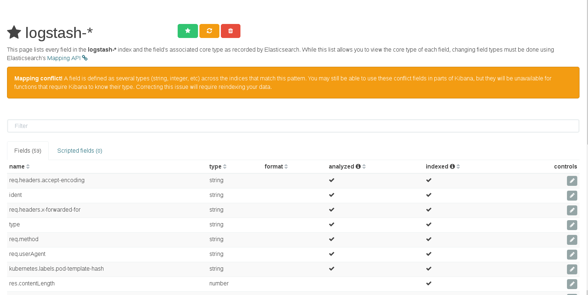
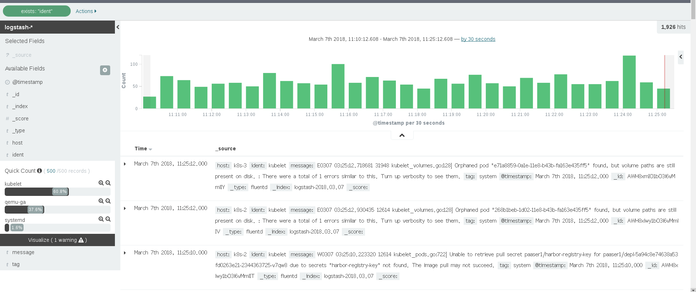

### 2.1 收集system日志
系统日志可以通过端口收集，由于fluentd是运行在容器环境，最好还是通过文件拉取

### 2.1.1 配置fluentd收集系统日志
对于centos机器系统日志存放在/var/log/messages 下， 可以修改fluentd-config.yaml，添加下面选项
```
    <match fluent.**>
      type null
    </match>
    # Example:
    # {"log":"[info:2016-02-16T16:04:05.930-08:00] Some log text here\n","stream":"stdout","time":"2016-02-17T00:04:05.931087621Z"}
    <source>
      type tail
      path /var/log/containers/*.log
      pos_file /var/log/es-containers.log.pos
      time_format %Y-%m-%dT%H:%M:%S.%NZ
      tag kubernetes.*
      format json
      read_from_head true
    </source>
    <filter kubernetes.**>
      type kubernetes_metadata
    </filter>
    # 下面新加的选项
    <source>
      type tail
      format syslog
      path /var/log/messages
      pos_file /var/log/messages.pos
      tag system
    </source>
```
fluentd可以通过syslog更是自动识别，并且通过syslog格式的ident字段，自动识别docker，kuberlet，etcd， systemd等日志


### 2.1.2 在kibana获取日志
更新以后需要在kibnana界面上重新刷新index才可以

- 进入setting页面如下图


- 点击Create刷新index
 
- 通过系统日志indet字段过滤日志
切换到search页面， 在左边点击index`ident`, 点击显示所有`（500/500）`,indet下就有syslog下所有日志分类。


