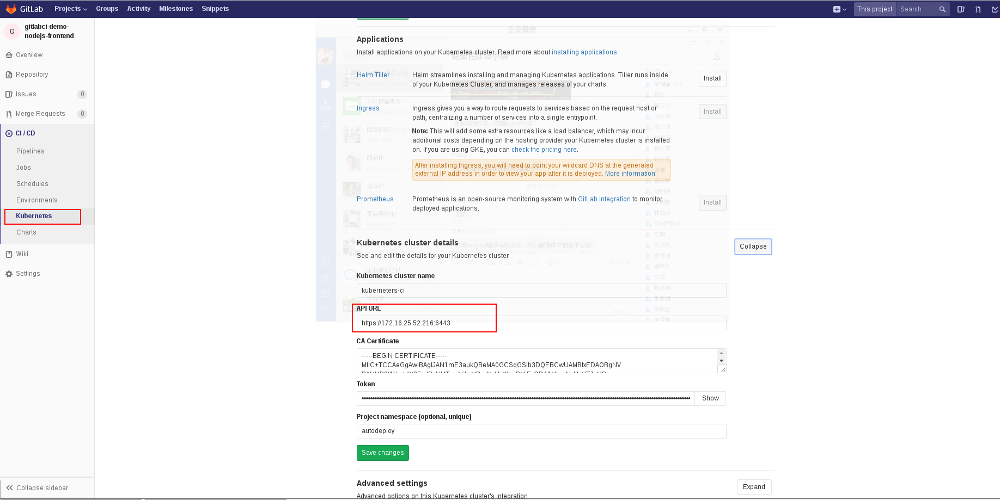
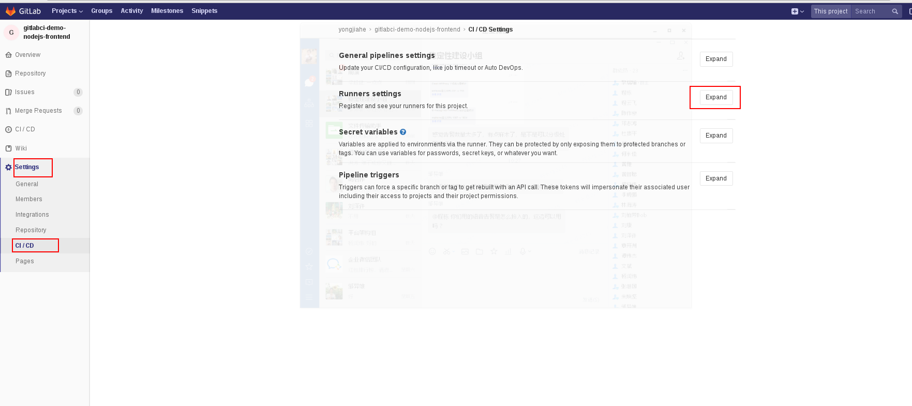
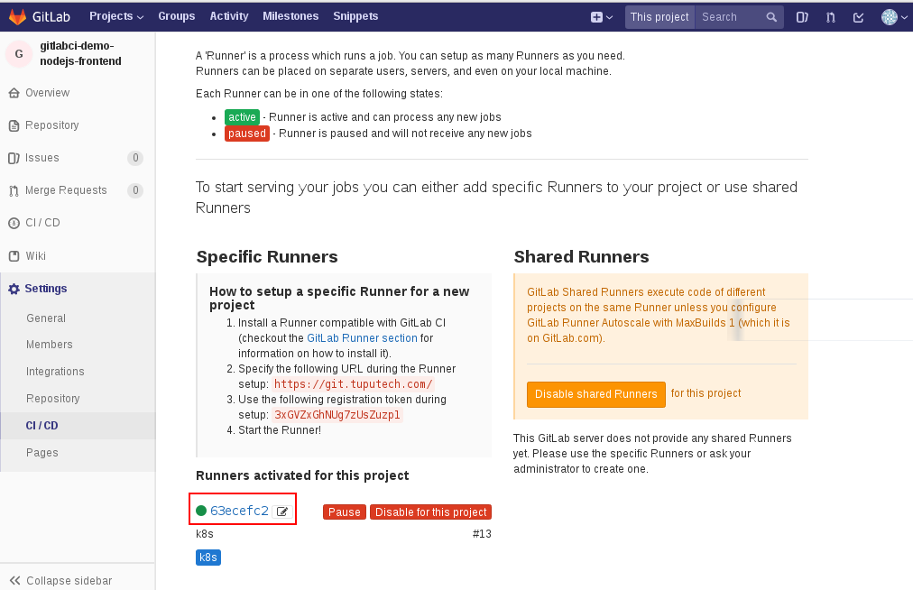
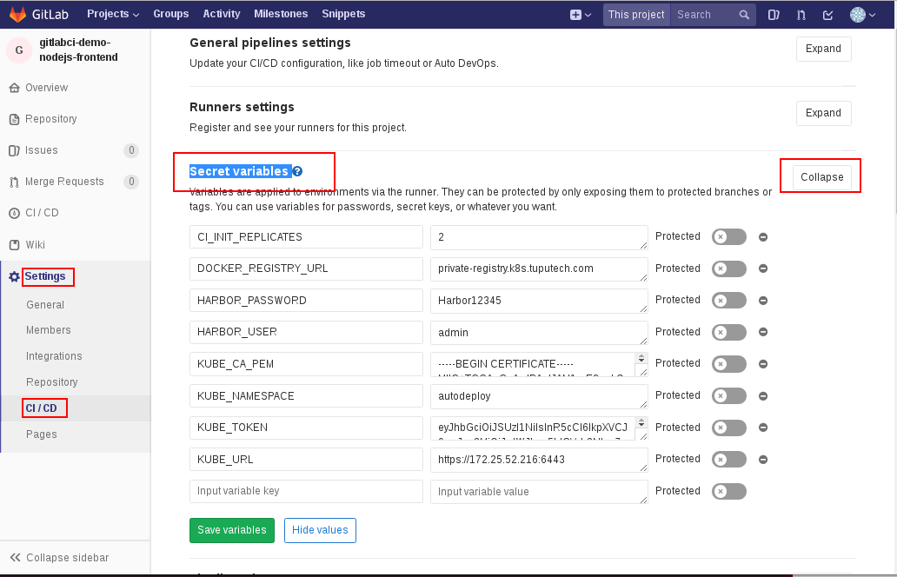
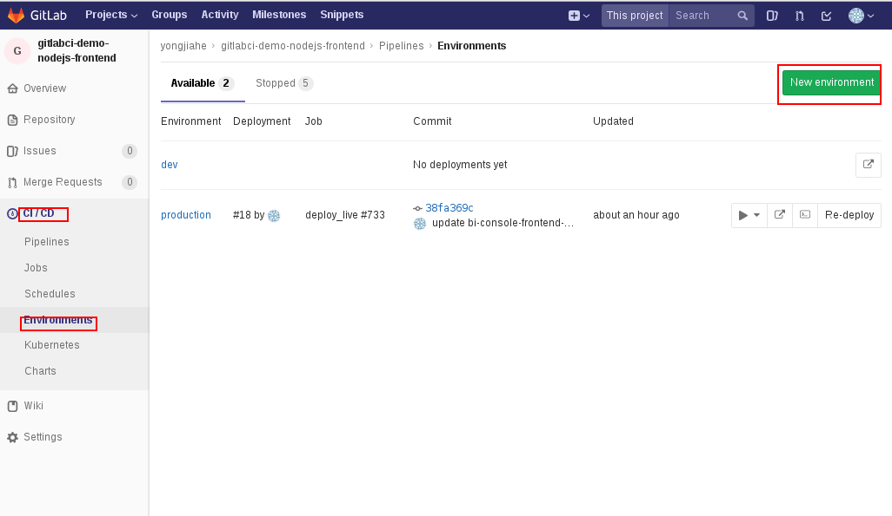
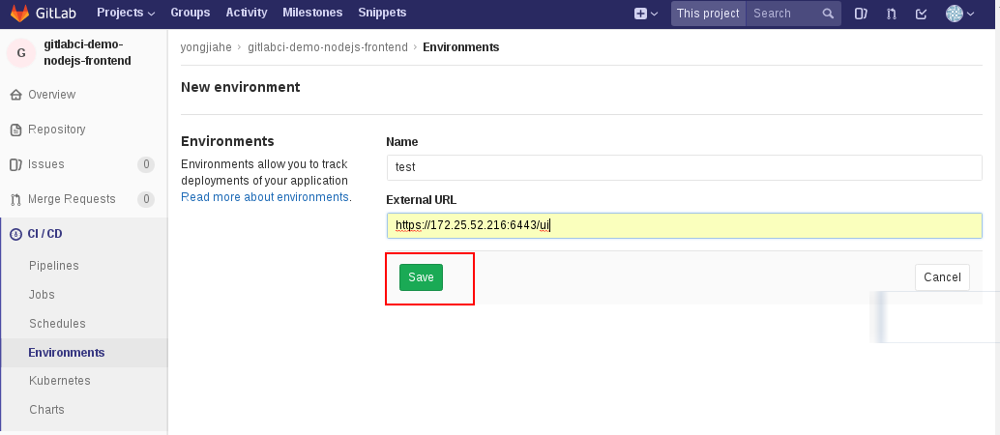
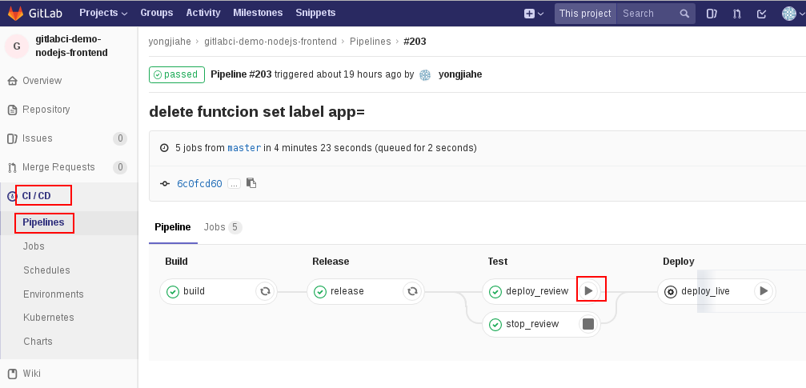
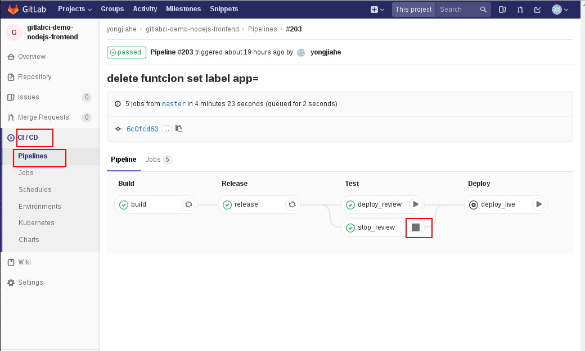
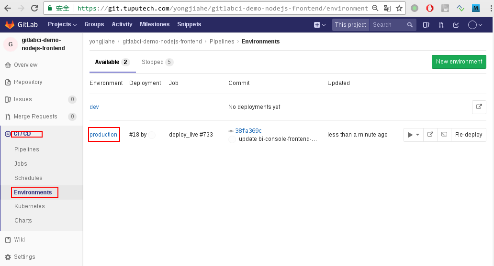
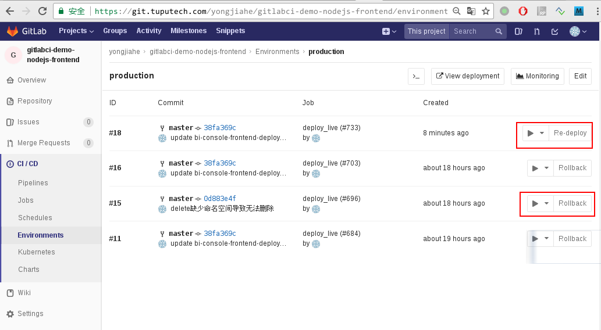

## Gitlab CI/CD 
   GitLab CI是 GitLab 提供的持续集成服务，只要在你的仓库根目录 创建一个.gitlab-ci.yml 文件， 并为该项目指派一个Runner，当有合并请求或者 push的时候就会触发build。
   通过gitlab 和 k8s 结合优点：
   - k8s 提供runner，以及每一步job提供计算资源： 编译代码，制作镜像，部署测试环境
   - 通过gitlab部署环境都有记录，便于以后跟踪和回滚
   - k8s提自动化更新/快速回滚环境。

### Gliblib CI/CD 添加kubernetes 集群
  CI/CD所有配置需要项目管理员权限

添加k8s集群如图


API URL:
```
https://172.25.52.217
```

CA Certificate
```
-----BEGIN CERTIFICATE-----
MIIC+TCCAeGgAwIBAgIJAN1mE3aukQBeMA0GCSqGSIb3DQEBCwUAMBIxEDAOBgNV
BAMMB2t1YmUtY2EwIBcNMTgwNjIwMDczMzUyWhgPMjExODA1MjcwNzMzNTJaMBIx
EDAOBgNVBAMMB2t1YmUtY2EwggEiMA0GCSqGSIb3DQEBAQUAA4IBDwAwggEKAoIB
AQDNp4SW8k/yZY29nmEFyD8wfMplNi6AQqX272PWDnID8x8nuzOnbDs9m0bCkv59
d89ih+4VQMjeuUTaKf943Ar4ACaH4CZDrm20uzo6ueO73PdDmrwpoHG3KQuBLDw8
rBXbOS1KS5x1p2eCrEs/ppQ5obmvWsgwo7HwFdJaL2VOrYdWQ2itS0fKC5Hu2Eoc
/bzp1oLYtVI+fnK25oZwsJUJ4bGNeDoH30qvaKvXqIoM8kaTdE91WhOOgdRJvCWR
qWtEhkV0BLgytVAhOLGJ7a7CBD2KAs5eA0Uqe4uWJGnVqWwW5DfXNzZjkxXeMr5K
Bpwcxl8pj7XXor8DDut0zBGPAgMBAAGjUDBOMB0GA1UdDgQWBBSFx6/VStlwbxAX
trDf76JS55XRrTAfBgNVHSMEGDAWgBSFx6/VStlwbxAXtrDf76JS55XRrTAMBgNV
HRMEBTADAQH/MA0GCSqGSIb3DQEBCwUAA4IBAQDBmtUtfDGP/2QEjlNzI4hO5cGu
G3N/YH2hvox3Fw9LJvfFcs6RJ7/zCBkroKTJHhyhQkcFoaosH3hi8HoFuRp0IAOp
jNE1y9/Q/Yhnamr88y2PMZ5Gzl5RTcS1X62c9hxfL7FdRMt7z+jT+nUJWHl9iZiC
XuI/jG0boULEJG6T3WLxc+GllydPBM5u4RVUIn+V5QhgB1glwKSv8wDldI9lZNHR
0ZDuTc3RS8qBt0ntmVupiIZ41gfK6zbpxOILTuQitLcPDRFqo0PMdrF845v8is2g
zbKVd9aWVhXA5hqtpw2p0fngQtAaNP/l2j3AQk/jrryKNjNF1J7CDCEl/BAO
-----END CERTIFICATE-----
```

Token:
```
eyJhbGciOiJSUzI1NiIsInR5cCI6IkpXVCJ9.eyJpc3MiOiJrdWJlcm5ldGVzL3NlcnZpY2VhY2NvdW50Iiwia3ViZXJuZXRlcy5pby9zZXJ2aWNlYWNjb3VudC9uYW1lc3BhY2UiOiJhdXRvZGVwbG95Iiwia3ViZXJuZXRlcy5pby9zZXJ2aWNlYWNjb3VudC9zZWNyZXQubmFtZSI6InJ1bm5lci1zZXJ2aWNlYWNjb3VudC10b2tlbi1xYzh3cCIsImt1YmVybmV0ZXMuaW8vc2VydmljZWFjY291bnQvc2VydmljZS1hY2NvdW50Lm5hbWUiOiJydW5uZXItc2VydmljZWFjY291bnQiLCJrdWJlcm5ldGVzLmlvL3NlcnZpY2VhY2NvdW50L3NlcnZpY2UtYWNjb3VudC51aWQiOiI4N2E0MDJkNS05ZmI5LTExZTgtYmJkNC03Y2QzMGE1NTg1NTAiLCJzdWIiOiJzeXN0ZW06c2VydmljZWFjY291bnQ6YXV0b2RlcGxveTpydW5uZXItc2VydmljZWFjY291bnQifQ.1ytje1jzUnwebB_fGdL7jiULFU3rKQwrZ8vA52u3q-V9DVJjnzknwlu_-6gpSVRlYDUyy5sZdO-GmVyqZxadVglbbySaGMVb5DnP-tPEZHbC_7TkmpQnSS7wg7rQRAshYXLtNUvcREYYKOQoH9qVt9Q9l0v_Y_u7HYxHrOY3DxZL6XA8LGqII3zcpyUs0w-M9zt68GPLLz8M7Hy-CDPQNr8omsXLcg5172oAIx5tsD1CMo4eUvUpGcvGEi79IirRDNY2KUxImySuIwZhMqSGoRYkJpqXD4AgNo9F8mV0Z8-41ej8Bb26dgLRkqouebyMPeutTtEzKXLp5K_-UsiK4Q
```

Project namespace (optional, unique)
```
autodeploy
```

配置完毕点击**save change**


### 添加已经存在k8s-gitlab runner

   Gitlab CI/CD需要通过gitlab runner 在k8s集群上申请资源进行CI/CD： 编译打包， 制作镜像， 部署应用。 需要添加runner才可以执行CI/CD 任务.
   搭建runner可以参考启动伟文档，  不需要每个项目搭建一个runner， 大家共享一个runner也可以。把启伟加入项目组以后，可以在下面页面上看到runner信息。步骤
   **Setting**->**CI/CD**->**Runner settrings** 如图:
   
   
   选择存在runner:
   


### 配置项目环境变量

   配置环境变量用于保存项目信息， 镜像仓库相关帐号信息， k8s帐号信息等, 配置步骤如下:
   **Setting**->**CI/CD**->**Secret variables** 如图
    

    环境变量需要按照用户需要去定义， 这里是常用环境变量：

| 变量名 | 值 | 作用 |
|--------|--------|--------|
|  CI_INIT_REPLICATES  |   2     | 开始部署时候replicate数目，后面更新最新数目部署|
|  DOCKER_REGISTRY_URL | private-registry.k8s.tuputech.com | 镜像仓库地址 |
|  HARBOR_PASSWORD     | Harbor12345 | 镜像仓库密码 |
| HARBOR_USER| admin| harbor 用户名|
|  KUBE_CA_PEM | CA Certificate 证书|  https 擦证书|
| KUBE_NAMESPACE| autodeploy | 应用部署k8s命名空间|
| KUBE_TOKEN|  参考 Token |  k8s 验证信息|
| KUBE_URL| https://172.25.52.216:6443 | k8s url |

### 添加部署环境
  对应k8s来说， 不同环境就是不同deployment/statefulset， 通过gitlab 环境镜像更新管理/回滚操作， 下面添加测试/生产环境

**CI/CD**->**Environments**


按照要求输入:



### 项目中编写dockerfile

   在创建dockerfile前编写项目根目录添加`.dockerignore`， 编写打镜像不需要文件:
```
.git
.dockerignore
.gitignore
```

   在根目录创建一个文件`dockerfile`, nodejs后端dockerfile模版如下:

```
FROM node:8
# 维护者信息
MAINTAINER "heyongjia"

RUN mkdir /app
COPY ./ /app/

WORKDIR /app
# 制作docker镜像的时候自动安装需要包
RUN npm install
# app启动命名， 可以是其他命令， 每个参数都需要“”, 需要保证这个命令在前台一直运行，退出这个命令容器就退出，如果使用pm2，保证一直运行在前台
CMD ["npm", "run", "start"]
```

如果需要添加npm加速代码如下:

```
FROM node:8
# 维护者信息
MAINTAINER "heyongjia"

RUN npm set registry https://registry.npm.taobao.org && \
    npm set disturl https://npm.taobao.org/dist && \
    npm set chromedriver_cdnurl http://cdn.npm.taobao.org/dist/chromedriver && \
    npm set operadriver_cdnurl http://cdn.npm.taobao.org/dist/operadriver && \
    npm set phantomjs_cdnurl http://cdn.npm.taobao.org/dist/phantomjs && \
    npm set sass_binary_site http://cdn.npm.taobao.org/dist/node-sass && \
    npm set electron_mirror http://cdn.npm.taobao.org/dist/electron/ && \
    npm set selenium_cdnurl=http://npm.taobao.org/mirrors/selenium && \
    npm set node_inspector_cdnurl=https://npm.taobao.org/mirrors/node-inspector

RUN mkdir /app
COPY ./ /app/

WORKDIR /app
RUN npm install
CMD ["npm", "run", "start"]
```


## 编写gitlab-ci.yml文件

### 编写k8s 部署模版

   在项目根目录下添加yaml/tmpl/ 文件夹存放模版:

应用部署模版
bi-console-frontend-deployment.yaml
```
apiVersion: apps/v1beta1
kind: Deployment
metadata:
  # 前面部分写项目名称 后面部署在构建时候被环境替掉
  name: gitlabci-demo-nodejs-frontend-__CI_ENVIRONMENT_SLUG__
  labels:
    # 系统名称
    system: bi-console
    # 当前这个模块名称和项目名称一样就可以了
    service: gitlabci-demo-nodejs-frontend 
    app: __CI_ENVIRONMENT_SLUG__
    track: __CI_ENVIRONMENT_APP_TRACK_SLUG__
spec:
  # 实例数目 被CI_INIT_REPLICATE替换
  replicas: __CI_ENVIRONMENT_APP_REPLICATES_SLUG__ 
  revisionHistoryLimit: 10
  minReadySeconds: 10
  strategy:
    type: RollingUpdate
    rollingUpdate:
      maxSurge: 30%
      maxUnavailable: 10%
  template: # create pods using pod definition in this template
    metadata:
      labels:
        # 系统名称
        system: bi-console
        # 当前这个模块名称和项目名称一样就可以了
        service: gitlabci-demo-nodejs-frontend 
        app: __CI_ENVIRONMENT_SLUG__
        track: __CI_ENVIRONMENT_APP_TRACK_SLUG__
    spec:
      containers:
      - name: bi-console-frontend
        image: private-registry.k8s.tuputech.com/tupu/gitlabci-demo-nodejs-frontend:__CI_ENVIRONMENT_APP_VERSION_SLUG__
        ports:
        # k8s上每个pod都有一个独立ip， 多个实例/多个应用端口不会有冲突的
        - containerPort: 80
        # defines the health checking
        resources:
          # 应用最高资源限制（如果内存资源超过触发oom， cpu资源通过cgroup限制）
          limits:
            cpu: 100m
            memory: 100Mi
          # 应用调度到机器必须满足下面资源需求(预留)
          requests:
            cpu: 100m
            memory: 10Mi

```

负载均衡器配置
```
apiVersion: v1
kind: Service
metadata:
  ## 前面部分写项目名称 后面部署在构建时候被环境替掉
  name: gitlabci-demo-nodejs-frontend-__CI_ENVIRONMENT_SLUG__
  labels:
    system: bi-console
    service: gitlabci-demo-nodejs-frontend 
    app: __CI_ENVIRONMENT_SLUG__
spec:
  # 使用集群端口， 端口由集群随机分配 30000~32767之间
  type: NodePort
  ports:
    # 对应容器导出端口
    - port: 80
      targetPort: 80
      protocol: TCP
  selector:
    system: bi-console
    service: gitlabci-demo-nodejs-frontend 
    app: __CI_ENVIRONMENT_SLUG__
```

### 编写gitlab-ci配置文件

   配置CI/CD配置文件， 项目根目录添加文件`.gitlab-ci.yml`， 当前第一版本， 有3个步骤， 一制作镜像， 部署测试环境， 更新稳定环境， 文件模版如下:
   
```
stages:
  - build
  - test
  - deploy

variables:
  CONTAINER_IMAGE: ${DOCKER_REGISTRY_URL}/tupu/${CI_PROJECT_NAME}

### 制作镜像
build:
  stage: build
  image: docker:latest
  script:
    - echo CI_COMMIT_SHA ${CI_COMMIT_SHA:0:8}
    - docker login -u ${HARBOR_USER} -p ${HARBOR_PASSWORD} ${DOCKER_REGISTRY_URL}
    - docker build -t ${CONTAINER_IMAGE}:${CI_COMMIT_SHA:0:8} ./
    - docker push ${CONTAINER_IMAGE}
    - echo CI_PROJECT_NAME ${CI_PROJECT_NAME}
    - echo CI_COMMIT_SHA ${CI_COMMIT_SHA:0:8}
    - docker info
  dependencies: []

### 部署测试版本到测试环境 （手动）
deploy_review:
  image: lachlanevenson/k8s-kubectl:v1.10.6-bash
  stage: test
  script:
    - set_kubectl_context
    - deploy test 1
    - echo ${CI_ENVIRONMENT_SLUG} 
  when: manual
  dependencies: []
  environment:
    name: test/${CI_BUILD_REF_NAME}
    url: https://172.25.52.216:6443
    on_stop: stop_review

### 点击停止review，删除测试环境（手动） 
stop_review:
  image: lachlanevenson/k8s-kubectl:v1.10.6-bash
  stage: test
  script:
    - set_kubectl_context
    - delete
    - kubectl get pod -n ${KUBE_NAMESPACE}
  when: manual
  dependencies: []
  environment:
    name: test/${CI_BUILD_REF_NAME}
    action: stop

### 部署稳定版本生产环境
deploy_live: 
  image: lachlanevenson/k8s-kubectl:v1.10.6-bash
  stage: deploy 
  script:
    - set_kubectl_context
    - export replicates=$(cal_stable_deployment_replicates)
    - deploy stable ${replicates}
    - kubectl get pod -n ${KUBE_NAMESPACE}
  when: manual
  dependencies: []
  environment:
    name: production

### 脚本函数
.auto_devops: &auto_devops |
    function set_kubectl_context() {
       kubectl config set-cluster default-cluster --server=${KUBE_URL} --certificate-authority=/var/run/secrets/kubernetes.io/serviceaccount/ca.crt
       kubectl config set-credentials default-admin --token=${KUBE_TOKEN}
       kubectl config set-context default-system --cluster=default-cluster --user=default-admin --namespace ${KUBE_NAMESPACE}
       kubectl config use-context default-system 
       kubectl cluster-info
    }

    function deploy() {
        track=${1:-stable}
        replicates=${2}
        #name=${CI_PROJECT_NAME}
       
        #if [[ "$track" != "stable" ]]; then
        #    name="$name-$track"
        #fi

        sed -i "s/__CI_ENVIRONMENT_SLUG__/${CI_ENVIRONMENT_SLUG}/g" ${CI_PROJECT_DIR}/yaml/tmpl/*.yaml
        sed -i "s/__CI_ENVIRONMENT_APP_TRACK_SLUG__/${track}/g" ${CI_PROJECT_DIR}/yaml/tmpl/*.yaml
        sed -i "s/__CI_ENVIRONMENT_APP_REPLICATES_SLUG__/${replicates}/g" ${CI_PROJECT_DIR}/yaml/tmpl/*.yaml
        sed -i "s/__CI_ENVIRONMENT_APP_VERSION_SLUG__/${CI_COMMIT_SHA:0:8}/g" ${CI_PROJECT_DIR}/yaml/tmpl/*.yaml
        #sed -i "s/__CI_ENVIRONMENT_APP_VERSION_SLUG__/ab095e9b/g" ${CI_PROJECT_DIR}/yaml/tmpl/*.yaml
        kubectl apply -f ${CI_PROJECT_DIR}/yaml/tmpl/ -n ${KUBE_NAMESPACE}
        kubectl get pod -n ${KUBE_NAMESPACE}
        kubectl get svc -o wide -n ${KUBE_NAMESPACE}
    }

    function get_deployment_replicates() {
        name=${1}
        namespace=${2}

        if [[ -n $name ]] && [[ -n $namespace ]]; then
            replicates=`kubectl get deployment -n $namespace $name  | sed -n "2,1p" | awk -F ' ' '{print $2}' `
        elif [[ -n $name ]]; then
            replicates=`kubectl get deployment -n $namespace $name  | sed -n "2,1p" | awk -F ' ' '{print $2}' `
        else
            replicates=0
        fi

        if [[ ! -n $replicates ]]; then
            replicates=0
        fi

        echo $replicates
    }


    function delete() {
        kubectl delete service -l app=${CI_ENVIRONMENT_SLUG} -n ${KUBE_NAMESPACE}
        kubectl delete deployment -l app=${CI_ENVIRONMENT_SLUG} -n ${KUBE_NAMESPACE}
    }

before_script:
  - *auto_devops
```

### 提交代码部署测试环境
   
   把`.gitlab-ci.yml`，`dockerfile`, `yaml/tmpl/` 文件提交到代码git仓库推送到gitlab服务器后就可以自动CI/CD. 以后提交以后，等待制作镜像成功， 进入**CI/CD**->**Pipeline** 如图:



点击后就可以部署测试环境。 点击deploy_live就部署生产环境。

### 关闭review环境(删除测试环境)
  
   测试完毕以后可以通过下面步骤关闭测试环境释放资源:
   


### 生产环境回滚指定版本原理
   更新生产环境以后，如果出现问题， 可以按照项目操作进行回滚

**CI/CD**->**Environments**->**production**


进入**production**生产环境以后:


原理:
```
apiVersion: apps/v1beta1
kind: Deployment
metadata:
  # 前面部分写项目名称 后面部署在构建时候被环境替掉
  name: gitlabci-demo-nodejs-frontend-__CI_ENVIRONMENT_SLUG__
  labels:
    # 系统名称
    system: bi-console
    # 当前这个模块名称和项目名称一样就可以了
    service: gitlabci-demo-nodejs-frontend 
    app: __CI_ENVIRONMENT_SLUG__
    track: __CI_ENVIRONMENT_APP_TRACK_SLUG__
spec:
  ....
  template: # create pods using pod definition in this template
   .....
    spec:
      containers:
      - name: bi-console-frontend
        ### 不同版本deployment 文件__CI_ENVIRONMENT_APP_VERSION_SLUG__不同， redpeloy更新image版本就可以了
        image: private-registry.k8s.tuputech.com/tupu/gitlabci-demo-nodejs-frontend:__CI_ENVIRONMENT_APP_VERSION_SLUG__
        ports:
        # k8s上每个pod都有一个独立ip， 多个实例/多个应用端口不会有冲突的
        - containerPort: 80
        # defines the health checking
        resources:
          limits:
            cpu: 100m
            memory: 100Mi
          requests:
            cpu: 100m
            memory: 10Mi
```


