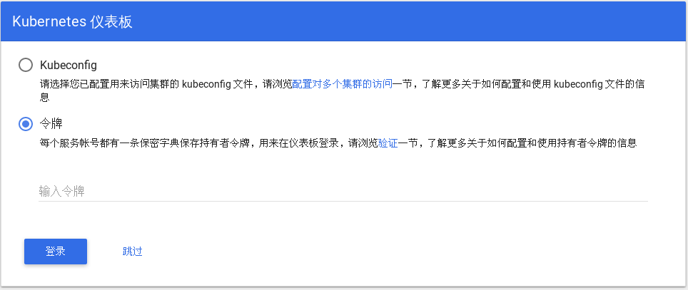

### 登陆配置

首先在浏览器输入界面输入k8s master ip地址： 例如:192.168.0.1:8080/ui, 如图：


选择令牌认证。

### 生成令排token

需要创建一个 admin 用户并授予 admin 角色绑定，使用下面的 yaml 文件创建 admin 用户并赋予他管理员权限，然后可以通过 token 登陆 dashbaord，该文件见 admin-role.yaml。这种认证方式本质上是通过 Service Account 的身份认证加上 Bearer token 请求 API server 的方式实现
```
kind: ClusterRoleBinding
apiVersion: rbac.authorization.k8s.io/v1beta1
metadata:
  name: admin
  annotations:
    rbac.authorization.kubernetes.io/autoupdate: "true"
roleRef:
  kind: ClusterRole
  name: cluster-admin
  apiGroup: rbac.authorization.k8s.io
subjects:
- kind: ServiceAccount
  name: admin
  namespace: kube-system
---
apiVersion: v1
kind: ServiceAccount
metadata:
  name: admin
  namespace: kube-system
  labels:
    kubernetes.io/cluster-service: "true"
    addonmanager.kubernetes.io/mode: Reconcile
```

然后执行下面的命令创建 serviceaccount 和角色绑定，对于其他命名空间的其他用户只要修改上述 yaml 中的 name 和 namespace 字段即可：
```
$kubectl create -f admin-role.yaml
```

创建完成后获取 secret 和 token 的值：
```
$kubectl -n kube-system get secret | grep ad
admin-token-bz6ml                                kubernetes.io/service-account-token   3         5s
```
获取token的值
```
apiVersion: v1
data:
====
kind: Secret
metadata:
  annotations:
    kubernetes.io/service-account.name: admin
    kubernetes.io/service-account.uid: 427746e9-5a61-11e8-83ff-fa163e4a8013
  creationTimestamp: 2018-05-18T06:04:00Z
  name: admin-token-bz6ml
  namespace: kube-system
  resourceVersion: "11458"
  selfLink: /api/v1/namespaces/kube-system/secrets/admin-token-bz6ml
  uid: 427bf163-5a61-11e8-95b9-fa163e6274ff
type: kubernetes.io/service-account-token
```

在 dashboard 登录页面上使用上面输出中的那个非常长的字符串进行 base64 解码后作为 token 登录，即可以拥有管理员权限操作整个kubernetes集群中的对象。当然您也可以将这串 token 进行 base64 解码后，加到 admin 用户的kubeconfig文件中，继续使用kubeconfig登录，两种认证方式任您选择。

注意：一定要将 kubectl 的输出中的 token 值进行 base64 解码，在线解码工具 base64decode，Linux 和 Mac 有自带的 base64 命令也可以直接使用，输入 base64 是进行编码，Linux 中base64 -d 表示解码，Mac 中使用 base64 -D。

也可以使用 jsonpath 的方式直接获取 token 的值，如
```
$kubectl -n kube-system get secret admin-token-bz6ml -o jsonpath={.data.token}|base64 -d
```

最后把字符串拷贝到界面.


