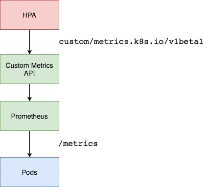

## Custom Metrics Server
为了根据custom metrics进行扩展，您需要有两个组件:
- 一个从应用程序中收集指标并将其存储为Prometheus时间序列数据库的组件。
- 第二个组件将Kubernetes自定义指标API扩展到由收集的k8s-prometheus-adapter提供的指标。

流程如图



### 部署k8s-prometheus-adapter

下载对应工程:
```
git clone https://github.com/DirectXMan12/k8s-prometheus-adapter.git
```

目前我们prometheus-adapter使用cert证书由程序自动生成到/apiserver.local.config/ 而不用自己手动生成需要修改

需要修改项目deploy/manifests/ 相关文件， 

修改custom-metrics-apiserver-deployment.yaml
```
apiVersion: apps/v1
kind: Deployment
metadata:
  labels:
    app: custom-metrics-apiserver
  name: custom-metrics-apiserver
  namespace: custom-metrics
spec:
  replicas: 1
  selector:
    matchLabels:
      app: custom-metrics-apiserver
  template:
    metadata:
      labels:
        app: custom-metrics-apiserver
      name: custom-metrics-apiserver
    spec:
      serviceAccountName: custom-metrics-apiserver
      # 修改用户为root用户， 否则无权限创建/apiserver.local.config/
      securityContext:
        runAsUser: 0
      containers:
      - name: custom-metrics-apiserver
        image: directxman12/k8s-prometheus-adapter-amd64
        args:
        - /adapter
        - --secure-port=6443
        # 让程序自动生成对应cert文件
        #- --tls-cert-file=/var/run/serving-cert/serving.crt
        #- --tls-private-key-file=/var/run/serving-cert/serving.key
        - --logtostderr=true
        - --prometheus-url=http://thanos-query.monitoring.svc.cluster.local:9090/
        - --metrics-relist-interval=1m
        - --v=10
        #- --config=/default-config.yaml
        # 和configmap 映射位置冲突
        - --config=/etc/adapter/config.yaml
        ports:
        - containerPort: 6443
        volumeMounts:
       # 屏蔽证书映射
       # - mountPath: /var/run/serving-cert
       #   name: volume-serving-cert
       #   readOnly: true
        - mountPath: /etc/adapter/
          name: config
          readOnly: true
        - mountPath: /tmp
          name: tmp-vol
      volumes:
      #- name: volume-serving-cert
      #  secret:
      #    secretName: cm-adapter-serving-certs
      - name: config
        configMap:
          name: adapter-config
      - name: tmp-vol
        emptyDir: {}
```

对应文件已经修改存放载`k8s-prometheus-adapter/manifests/`目录

首先需要创建对应命名空间`custom-metrics`
```
$kubectl create namespace custom-metrics
```

部署custom-metrics-server相关编排
```
$kubectl apply -f k8s-prometheus-adapter/manifests/.
```

部署以后是否正常启动
```
$ kubectl get pod -n custom-metrics                                           
NAME                                        READY     STATUS    RESTARTS   AGE
custom-metrics-apiserver-549bb6f94b-k6zjd   1/1       Running   0          14h
```

检查API 是否正常创建
```
$ kubectl api-versions
admissionregistration.k8s.io/v1alpha1
admissionregistration.k8s.io/v1beta1
apiextensions.k8s.io/v1beta1
apiregistration.k8s.io/v1beta1
apps/v1
apps/v1beta1
apps/v1beta2
authentication.k8s.io/v1
authentication.k8s.io/v1beta1
authorization.k8s.io/v1
authorization.k8s.io/v1beta1
autoscaling/v1
autoscaling/v2beta1
batch/v1
batch/v1beta1
certificates.k8s.io/v1beta1
custom.metrics.k8s.io/v1beta1
events.k8s.io/v1beta1
extensions/v1beta1
monitoring.coreos.com/v1
networking.k8s.io/v1
policy/v1beta1
rbac.authorization.k8s.io/v1
rbac.authorization.k8s.io/v1beta1
storage.k8s.io/v1
storage.k8s.io/v1beta1
v1
```
如果
custom.metrics.k8s.io/v1beta1

列出由prometheus提供的自定义指标：
```
kubectl get --raw "/apis/custom.metrics.k8s.io/v1beta1" | jq .
```

例如部署: podinfo 容器，容器提供自定义metrics

podinfo-deployment.yaml
```
apiVersion: apps/v1beta1
kind: Deployment
metadata:
  name: podinfo
spec:
  replicas: 1
  template:
    metadata:
      labels:
        app: podinfo
      annotations:
        prometheus.io/scrape: 'true'
        prometheus.io/port: '9898'
        prometheus.io/path: '/metrics' 
    spec:
      containers:
      - name: podinfod
        image: stefanprodan/podinfo:0.0.9
        imagePullPolicy: Always
        command:
          - ./podinfo
          - -port=9898
          - -logtostderr=true
          - -v=2
        volumeMounts:
          - name: metadata
            mountPath: /etc/podinfod/metadata
            readOnly: true
          - name: resources
            mountPath: /etc/podinfod/resources
            readOnly: true
        ports:
        - containerPort: 9898
          protocol: TCP
        readinessProbe:
          httpGet:
            path: /readyz
            port: 9898
          initialDelaySeconds: 1
          periodSeconds: 2
          failureThreshold: 1
        livenessProbe:
          httpGet:
            path: /healthz
            port: 9898
          initialDelaySeconds: 1
          periodSeconds: 3
          failureThreshold: 2
        resources:
          requests:
            memory: "32Mi"
            cpu: "10m"
          limits:
            memory: "256Mi"
            cpu: "100m"
      volumes:
        - name: metadata
          downwardAPI:
            items:
              - path: "labels"
                fieldRef:
                  fieldPath: metadata.labels
              - path: "annotations"
                fieldRef:
                  fieldPath: metadata.annotations
        - name: resources
          downwardAPI:
            items:
              - path: "cpu_limit"
                resourceFieldRef:
                  containerName: podinfod
                  resource: limits.cpu
              - path: "cpu_request"
                resourceFieldRef:
                  containerName: pthodinfod
                  resource: requests.cpu
              - path: "mem_limit"
                resourceFieldRef:
                  containerName: podinfod
                  resource: limits.memory
              - path: "mem_request"
                resourceFieldRef:
                  containerName: podinfod
                  resource: requests.memory
---
apiVersion: v1
kind: Service
metadata:
  name: podinfo-nodeport
  labels:
    app: podinfo
spec:
  type: NodePort
  ports:
    - name: http-metrics
      port: 9898
      targetPort: 9898
      nodePort: 31190可
      protocol: TCP
  selector:
    app: podinfo
```


配置podinfo service-monitor
```
apiVersion: monitoring.coreos.com/v1
kind: ServiceMonitor
metadata:
  name: podinfo
  namespace: monitoring
  labels:
    k8s-app: podinfo
spec:
  jobLabel: k8s-app
  endpoints:
  - port: http-metrics #和service配置名称一样
    interval: 60s
    honorLabels: true
  selector:
    matchLabels:
      app: podinfo
  namespaceSelector:
    matchNames:
    - default
```

启动服务以及对应的monitor
```
$kubectl apply -f ./
```

查询http_requests对应kind 
```
kubectl get --raw  "/apis/custom.metrics.k8s.io/v1beta1/namespaces/default/pods/*/http_requests" | jq .
{
  "kind": "MetricValueList",
  "apiVersion": "custom.metrics.k8s.io/v1beta1",
  "metadata": {
    "selfLink": "/apis/custom.metrics.k8s.io/v1beta1/namespaces/default/pods/%2A/http_requests"
  },
  "items": [
    {
      "describedObject": {
        "kind": "Pod",
        "namespace": "default",
        "name": "podinfo-7cd8684594-vcrcj",
        "apiVersion": "/__internal"
      },
      "metricName": "http_requests",
      "timestamp": "2018-07-17T06:23:10Z",
      "value": "650m"
    }
  ]
}
```

podinfo-hpa.yaml
```
---
apiVersion: autoscaling/v2beta1
kind: HorizontalPodAutoscaler
metadata:
  name: podinfo
spec:
  scaleTargetRef:
    apiVersion: extensions/v1beta1
    kind: Deployment
    name: podinfo
  minReplicas: 1
  maxReplicas: 3
  metrics:
  - type: Pods  # 上面kind属性一致
    pods:
      metricName: http_requests
      targetAverageValue: 700
```


获取hpa状态
```
$ kubectl get hpa podinfo
NAME      REFERENCE            TARGETS      MINPODS   MAXPODS   REPLICAS   AGE
podinfo   Deployment/podinfo   673m / 700   1         3         2          2m

```


