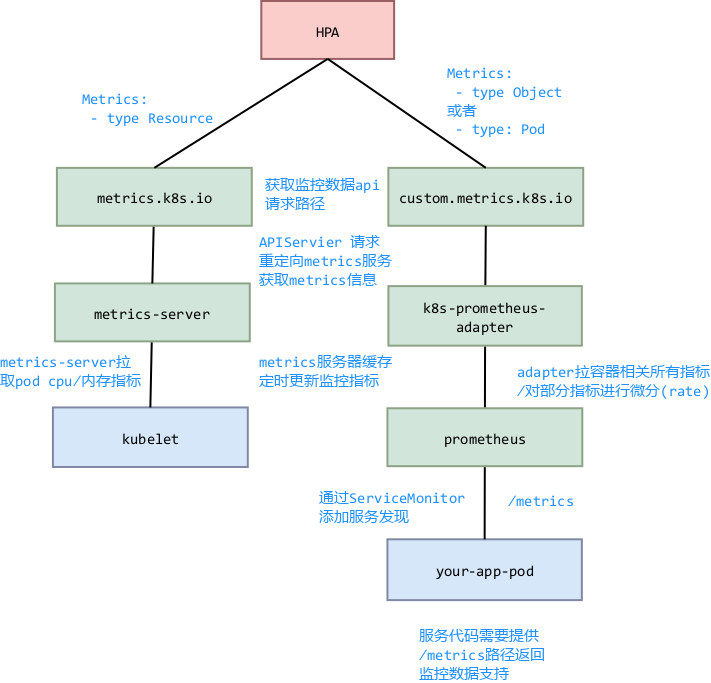

## k8s custom matrics 
   我们部署的自定义API服务器提供custom-metrics.metrics.k8s.io/v1alpha1 API组版本，并允许HPA控制器从中查询自定义指标。我们在这里使用的自定义API服务器是Prometheus适配器，它可以从Prometheus收集指标并通过REST查询将它们发送到HPA控制器.

### k8s HPA例子
   k8s hpa 指标可用通过metrics-server获取， 也可用通过custom-metrics服务获取， 通过下面不同hpa yaml说明hpa指标从什么服务获取:

appach-php-hpa.yaml
```
apiVersion: autoscaling/v2beta1
kind: HorizontalPodAutoscaler
metadata:
 name: php-apache-hpa
spec:
  scaleTargetRef:
    apiVersion: apps/v1beta1
    kind: Deployment
    name: php-apache 
  minReplicas: 1
  maxReplicas: 3
  metrics:
  - type: Resource
    resource:
      name: cpu
      targetAverageUtilization: 30
  - type: Resource
    resource:
      name: memory
      targetAverageValue: 150Mi
```

上面hpa扩展条件是
- pod cpu平均使用率是>30%
- pod 平均内存使用>150M

type为resource指标都是从`metrics.k8s.io`api组获取， api调转到`metrics-server`获取指定pods指标。 pod指标只支持内存，cpu两个方面。


```
apiVersion: autoscaling/v2beta1
kind: HorizontalPodAutoscaler
metadata:
  name: podinfo1
spec:
  scaleTargetRef:
    apiVersion: extensions/v1beta1
    kind: Deployment
    name: podinfo
  minReplicas: 1
  maxReplicas: 3
  metrics:
  - type: Pods  
    pods:
      metricName: http_requests
      targetAverageValue: 100m
```
type为pod/objce等，指标都是从`custom.metrics.k8s.io`api组获取， api调转到`k8s-prometheus-adapter`获取指定pods指标。 `k8s-prometheus-adapter`获取pod自定义metrics。需要程序代码提供.


object类型， 支持hpa使用其他应用指标， 使用服务指标

```
apiVersion: autoscaling/v2beta1
kind: HorizontalPodAutoscaler
metadata:
  name: xxxx
type: Object
object:
  metricName: http_requests
  target:
    apiVersion: v1
    kind: Service
    name: podinfo-nodeport
  targetValue: 100m
```

这个指标只有targetValue， service指标是service下1～n个pod对应指标总和


下面图介绍hpa获取metrics流程:


